# Git Workshop 3 - Assignment

All the steps and screenshots of each and every Scenrios are described as bellow:

## Git Commands and Concepts

### Scenario 1: Conflict Resolution
Task: Imagine you and your teammate are working on the same file, scenario01.txt. Both of you make changes to the same lines and commit them. Let’s say your teammate’s changes are merged first. And now when you try to merge your changes, a merge conflict occurs.

Approach: 

Step 1: Open the Command Prompt.

Step 2: Select the directory in which we want to work in.

Step 3: Initialize the git hub repository 

To initiate run

```bash
  git init
```
Step 4: run the following command for configuration (enter our own user name and email)

```bash
  git config user.name "<name>"

```
```bash
  git config user.email "<email>"
```
Step 5: make and commit changes in scenario01.txt file in a different brach.

```bash
  git branch features
  git add scenario01.txt
  git commit -m "changes made by person 2"
```
Step 6: merge our feature branch into main branch. A merge conflict will occur.

```bash
  git merge features
```
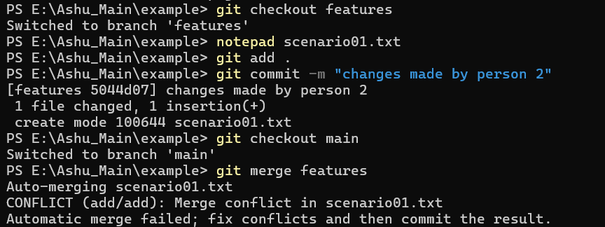

To resolve this conflict follow the steps below:

Step 1: Fetch the Latest Changes

First, ensure that our local repository is up-to-date with the remote repository.

```bash
git fetch origin
```
Step 2: Check Out the Main Branch

Switch to the main branch (or whichever branch we are merging into).

```bash
git checkout main
```
Step 3: Merge our Changes

Attempt to merge our changes. This will likely result in a merge conflict.

```bash
git merge features
```
Step 4: Resolve the Merge Conflict

Open the conflicted file project.txt in our text editor. We will see conflict markers indicating the conflicting sections.

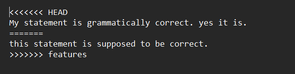

Step 5: Combine Changes

Edit the file to include both changes in the desired sequence. Remove the conflict markers and arrange the changes such that our teammate’s changes come first, followed by our changes.

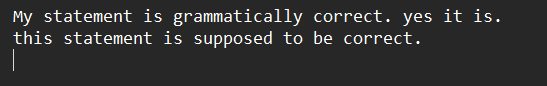

Step 7: Stage the Resolved File

After resolving the conflicts and saving the file, stage the resolved file.

```bash
git add scenario01.txt
```
Step 8: Complete the Merge

Commit the merge to complete the process.

```bash
git commit -m "Resolved merge conflict in scenario01.txt by combining changes"
```
Hence our conflict is resolved.

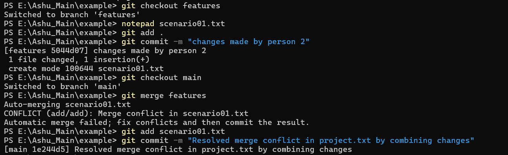


### Scenario 2: Add Files and Commit Together

Task: You have worked on multiple files and want to add them and commit using a single command.

Approach:

To add multiple files to the staging area and commit them using a single command, we can use the git commit -a option. This option tells Git to automatically stage files that have been modified and deleted, but it won't stage new (untracked) files. To include new files as well, you will need to use git add . before committing. Here’s how we can do it:

Step 1: Add All Files to the Staging Area and Commit

If we only need to stage modified and deleted files:

```bash
git commit -am "Your commit message"
```
If we need to stage new files along with modified and deleted files:

```bash
git add .
git commit -m "Your commit message"
```
Step 2: Verify the Commit by Checking the Commit Log

We can verify that your commit was successful by viewing the commit log:

```bash
git log
```
This will display a list of recent commits, showing the commit message, author, and other details.

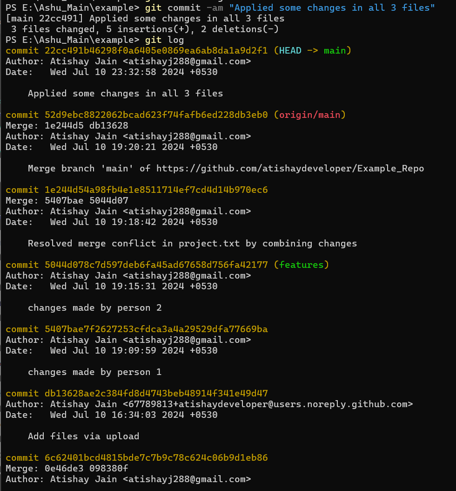

### Scenario 3: Include Additional Commit in the Previous Commit Message

Task: You have just made a commit but realize you forgot to include a file and make a small typo correction. Instead of creating a new commit, you can amend the last commit to include these changes without altering the commit message. Also verify the amended commit by checking the commit log.

Approach:

Step 1: Let’s stage the new file named as "new_pythagoras.py" and changes made in "pytho.py" file after the overall commitment of all the files.

```bash
git add new_pythagoras.py pytho.py
```

Step 2: Now Let’s commit the changes in the same commitment we did earlier.

```bash
git commit --amend --no-edit
```
Step 3: Verify the ammend commit by running the code below.
```bash
git log
```
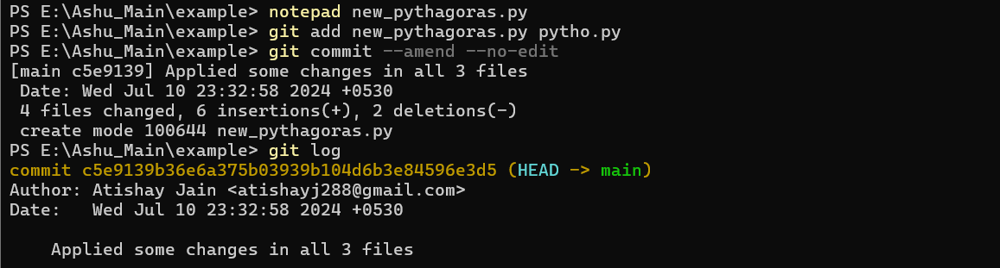

### Scenario 4: Stash Command

Task: You are working on a feature but need to quickly switch to another task without committing your current changes.

Approach:

The git stash command is very useful for saving your uncommitted changes temporarily so you can switch tasks without committing those changes. Here's how you can use git stash along with other related commands.

Step 1: Make Changes to a File but Do Not Commit Them
First, modify a file in our repository.(here we modified "python01.py")


Step 2: Stash the Changes

Stash our uncommitted changes.

```bash
git stash
```
This command will save our changes and revert our working directory to the state of the last commit.

Step 3: Verify That our Working Directory Is Clean

Check the status to ensure our working directory is clean.

```bash
git status
```

Step 4: Apply the Stashed Changes Back

When we’re ready to go back to our original task, apply the stashed changes.

```bash
git stash apply
```
This will reapply the stashed changes to our working directory. Our working directory should now include the changes we made before stashing.

Step 5: Experiment with Other Stash Commands

#### List Stashed Changes
To see a list of all stashes, use:

```bash
git stash list
```

#### Pop the Stash
The git stash pop command is similar to git stash apply, but it also removes the stash from the stash list after applying it.

```bash
git stash pop
```
#### Drop a Stash

If we just want to drop the latest stash, you can omit the identifier:

```bash
git stash drop
```
#### Clear All Stashes
To remove all stashes, use:

```bash
git stash clear
```
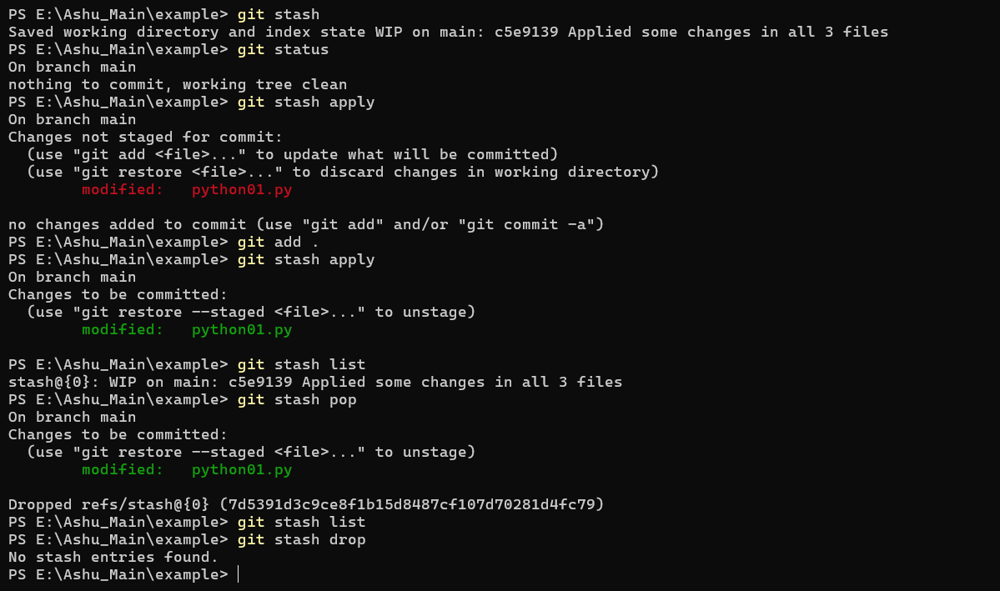

### Scenario 5: Use of .gitignore
Task: You have files in your project that should not be tracked by Git, such as log files or build artifacts.

Approach:


Using .gitignore to manage which files should and shouldn't be tracked by Git is a common practice. It helps keep the repository clean and ensures that unnecessary or sensitive files are not accidentally committed.

Step 1: Create a New Repository with Files

First, create a new directory for your repository and navigate into it:

```bash
mkdir example_repo
cd example_repo
```
Initialize a new Git repository:

```bash
git init
```
Create files that should and shouldn't be tracked:

```bash
echo "This file should be tracked" > tracked_file.txt
echo "This file should not be tracked" > ignored_file.log
```
Stage and commit the tracked file:

```bash
git add tracked_file.txt
git commit -m "Add tracked_file.txt"
```
Step 2: Create a .gitignore File

Create a .gitignore file to specify patterns for files that should be ignored by Git:

```bash
echo "*.log" > .gitignore
```
Stage and commit the .gitignore file:

```bash
git add .gitignore
git commit -m "Add .gitignore file to exclude log files"
```
Step 3: Verify Ignored Files Are Not Tracked

Check the status to verify that the ignored files are not tracked:

```bash
git status
```
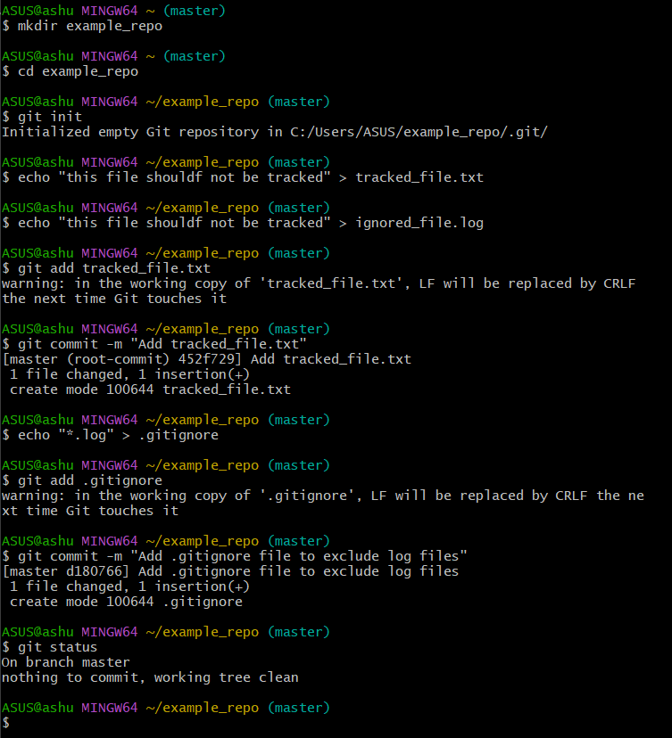

#### Explain Real-Life Use Cases of .gitignore
The .gitignore file is used to specify files and directories that should not be tracked by Git. This is useful for several reasons:

1. Prevent Clutter: Avoid tracking temporary files, build artifacts, or generated files that do not need to be versioned.
2. Protect Sensitive Information: Ensure that sensitive files (like configuration files with passwords or API keys) are not accidentally committed to the repository.
3. Improve Performance: Reduce the number of files Git has to track, improving performance for large projects.

The type of files one can include in .gitignore are log files, build artifacts, dependency directories, operating system files, and temporary files.

### Scenario 6: Revert to Previous Commits
Task: You made a mistake in a recent commit and need to revert the changes.

Approch:

Reverting to a previous commit is a common task in Git when we need to undo changes from a recent commit. Here are the steps to do that.

Step 1: Create a File and Commit Changes to the File

First, create a new file and make an initial commit.

```bash
echo "Initial content" > example.txt
git add example.txt
git commit -m "Add example.txt with initial content"
```
Step 2: Make Another Commit with a Mistake

Modify the file to introduce a mistake and commit the changes.

```bash
echo "This is a mistake" >> example.txt
git add example.txt
git commit -m "Add mistaken content to example.txt"
```
Step 3: Revert to the Previous Commit, Undoing the Mistake

Use git revert to create a new commit that undoes the changes from the mistaken commit. The HEAD~1 notation refers to the commit before the last one.

```bash
git revert HEAD
```
This command will create a new commit that undoes the changes from the last commit. Git will open our default text editor to allow us to edit the commit message. Save and close the editor to complete the revert.

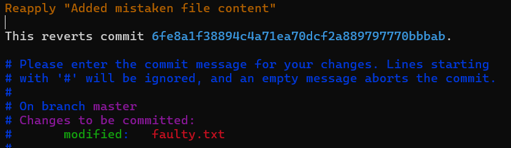

Step 4: Verify the State of the Repository to Ensure the Revert Was Successful

Check the content of example.txt and the commit history to verify that the revert was successful.

```bash
cat example.txt
```
You should see only the initial content:
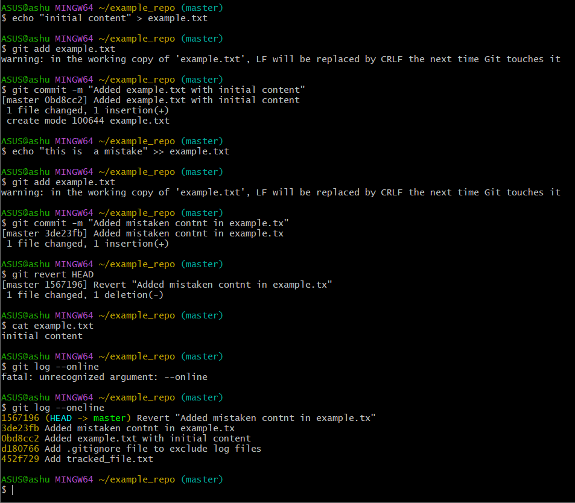

### Scenario 7: Create a Pull Request
Task: You have made changes on a feature branch and want to merge them into the main branch via a pull request.

Approach:

Creating a pull request is a common workflow in collaborative projects. It allows you to propose changes to a repository, discuss them, and review them before merging them into the main branch. Here are the steps to create a pull request.

Step 1: Create a New Branch from the Main Branch and Make Changes

First, ensure you are on the main branch and pull the latest changes:

```bash
git checkout main
git pull origin main
```
Create a new branch for your feature:

```bash
git checkout -b feature-branch
```
Make changes to your files:

```bash
echo "New feature content" > feature.txt
git add feature.txt
git commit -m "Add new feature content"
```
Step 2. Push the Branch to the Remote Repository

Push your new branch to the remote repository:

```bash
git push origin feature-branch
```
Step 3: Create a Pull Request to Merge Your Feature Branch into the Main Branch

Navigate to your repository on GitHub (or your Git hosting service). You should see a prompt to create a pull request for your recently pushed branch. If not, navigate to the "Pull requests" tab and click "New pull request".

Select your feature branch as the source and the main branch as the target for the pull request.


4. Describe the Changes in the Pull Request
In the pull request description, provide a detailed explanation of the changes you made:

Title: A concise summary of the changes (e.g., "Add new feature content")
Description: A more detailed description of what changes were made and why, including any relevant details or context.
Here's an example:

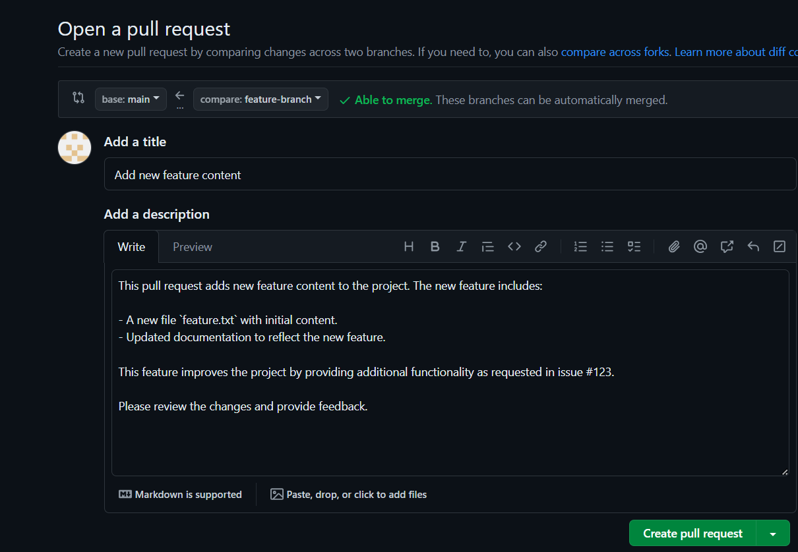


By following these steps, you can effectively create a pull request, making it easier for your team to review and merge changes into the main branch.


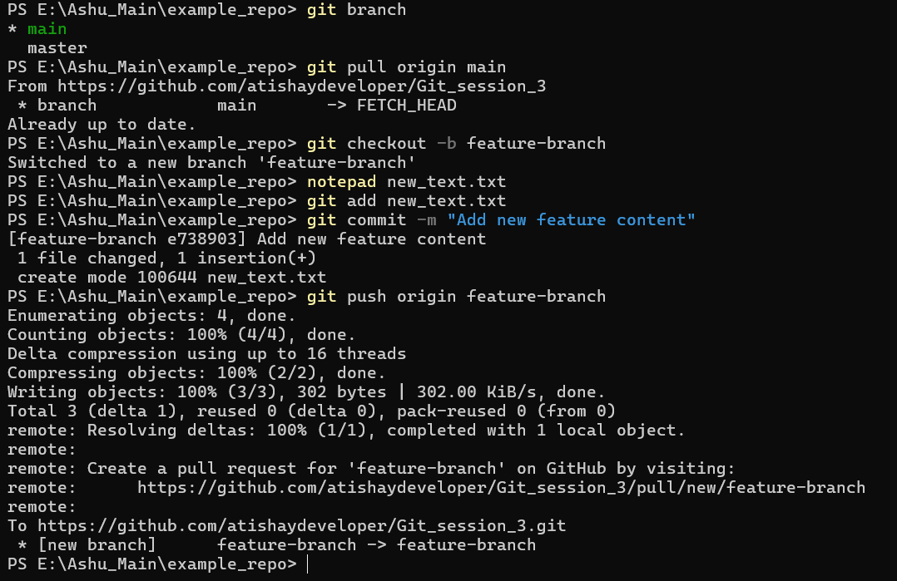

## Questions:


### 1. Why do we create branches in a repository and why do we create pull requests instead of merging directly?

=> Following are the advantags of creating branches:

- Enable isolated and parallel development.
- Facilitate testing, validation, and continuous integration.
- Help in version control and managing different code versions.

=> Following are the reasons to create a pull request instead of merging directly.

- Encourage code review, discussion, and collaboration.
- Ensure automated testing and validation.
- Help in conflict resolution and maintaining an audit trail.
- Provide access control and maintain code quality.

### 2. What is the difference between git add . and git add <filename>? What will we use when we have changes in multiples but we are not required to add some files?

#### About git add .
- This command stages all changes in the current directory and its subdirectories. This includes new files, modifications to existing files, and deletions.
- It can be very convenient when you want to add all changes in your project at once.

Example:
```bash
git add .
```

#### About git add <file_name>
- This command stages changes only for the specified file. It gives you fine-grained control over which changes are staged.
- Useful when you want to stage specific changes while leaving others uncommitted.
Example:
```bash
git add example.txt
```
#### Staging Multiple but Not All Changes
If you have changes in multiple files but do not want to add some files, you can use git add selectively:

1. Stage Specific Files:

- Use git add <filename> for each file you want to stage.
- Example:
```bash
git add file1.txt
git add file2.txt
```
2. Use Patterns:

- You can use patterns to stage groups of files.
- Example: Stage all .txt files in the current directory.
```bash
git add *.txt
```
3. Interactive Staging:

- Use git add -p (or --patch) to interactively review and stage changes hunk by hunk.
- Example:
```bash
git add -p
```
4. Ignoring Certain Files:

- You can use .gitignore to prevent certain files from being staged accidentally.
- Example: Add a .gitignore file with patterns for files you do not want to track.
```bash
# .gitignore
*.log
tmp/
```

### 3.What is the difference between git fetch and git pull?

=> git fetch and git pull are both commands used to update your local repository with changes from a remote repository. However, they serve different purposes and work in different ways.

1. #### git fetch
Description:

- The git fetch command downloads commits, files, and references from a remote repository into your local repository.
- It updates your remote-tracking branches (e.g., origin/main) but does not merge these changes into your current branch.
Use Case:

- Use git fetch when you want to see what changes are available on the remote repository without affecting your local work.
- It is useful for inspecting changes before deciding to incorporate them into your working directory.
Example:

```bash
git fetch origin
```
After running this command, you can inspect the changes using commands like git log origin/main or git diff origin/main.

2. #### git pull
Description:

- The git pull command is essentially a combination of git fetch and git merge.
- It downloads the changes from the remote repository and immediately tries to merge them into your current branch.
Use Case:

- Use git pull when you are ready to incorporate changes from the remote repository into your current branch.
- It is a quicker way to synchronize your branch with the remote but can sometimes lead to merge conflicts if there are conflicting changes.
Example:

```bash
git pull origin main
```
This command fetches the changes from the main branch of the remote repository origin and merges them into your current branch.

### 4. What is a head in a repository and what does it do?
=> HEAD is a reference to the current commit in the working directory. It points to the latest commit in the current branch you are working on.

=> It’s a symbolic reference, meaning it can move and point to different commits as you switch branches or create new commits.

=> Following are the functions of HEAD in a repository.
- Tracking the Current Branch
- Guiding Commits
- Switching Branches
- Detached HEAD State

### 5. What is the .git folder in a repository?
=> The .git folder is a hidden directory located at the root of a Git repository. It holds the repository’s metadata and the object database. The .git folder is a critical component of a Git repository. It contains all the information necessary for Git to track and manage the version history of your project. 

### 6. What are commit hashes and its use cases?
=>  It is a unique identifier assigned to a specific commit in a repository's history. Here's what it represents and some of its use cases:

- Unique Identification:- Each commit hash is a unique string of characters (typically hexadecimal) that serves as a fingerprint for a particular commit. It's generated using a cryptographic hash function and is virtually unique across all commits in the repository.

- Referencing Commits:- Commit hashes are used to refer to specific commits when performing operations such as branching, merging, reverting changes, and checking out specific versions of the codebase. Instead of using commit messages or timestamps, hashes provide an unambiguous way to pinpoint a commit.

- Version Tracking:- They facilitate precise tracking of changes over time. Developers can trace back through the commit history using hashes to understand when and why changes were made, which is crucial for debugging, auditing, and understanding the evolution of the codebase.

- Collaboration:- When collaborating on projects, commit hashes enable team members to synchronize their work effectively. By sharing hashes, developers can ensure that everyone is working from the same version of the codebase or referring to the same specific changes.

- Integration and Deployment:- In continuous integration and deployment pipelines, commit hashes are often used to trigger specific actions or deployments. For instance, deploying a version of the application that corresponds to a particular commit hash ensures that the exact code that passed testing and reviews is deployed.

- Code Reviews and Discussions:- During code reviews or discussions, referencing commit hashes helps reviewers and contributors focus on specific changes or issues. It provides a straightforward way to refer to the exact context of the discussion without ambiguity.

Overall, commit hashes play a fundamental role in the reliability, traceability, and collaboration aspects of version control systems like Git, ensuring that teams can work together efficiently while maintaining a clear history of changes to the codebase.

### 7. Different ways of syncing a branch with origin.
=> Here are different ways to sync a branch with origin in Git:

1. #### Fetch and Merge (or Rebase):

Fetch: Update your local repository with the latest changes from the remote without merging them into your current branch.
```bash
git fetch origin
```
Merge: Merge the fetched changes into your current branch. This creates a merge commit.
```bash
git merge origin/<branch-name>
```
or
```bash
git pull origin <branch-name>
```
Rebase: Alternatively, you can rebase your local changes onto the updated remote branch. This keeps a cleaner commit history by moving your changes to the tip of the updated branch.
```bash
git rebase origin/<branch-name>
```
2. #### Pull with Rebase:

Combine the fetch and rebase steps into a single command, pulling in the remote changes and rebasing your commits on top.
```bash
git pull --rebase origin <branch-name>
```
3. Push Forcefully:

In rare cases where you need to overwrite remote changes with your local changes (not recommended unless you understand the implications and have communicated with your team), you can force push:
```bash
git push --force origin <branch-name>
```
or safer alternative:
```bash
git push --force-with-lease origin <branch-name>
```
These methods provide flexibility depending on whether you want to preserve a clean commit history, integrate changes seamlessly, or handle more complex scenarios like divergent branches. Always consider communication with your team and the impact on shared history when choosing how to sync branches.


